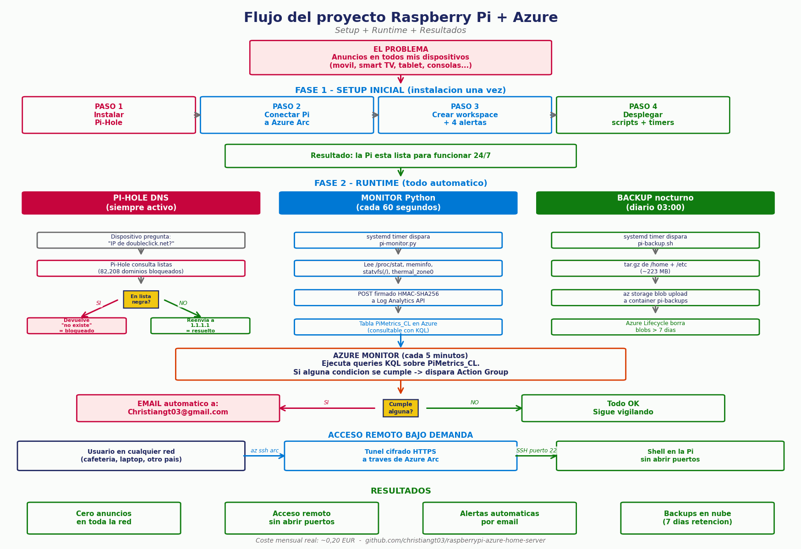

# Raspberry Pi Home Server — Pi-Hole + Azure

Convierte tu Raspberry Pi en un **mini-servidor cloud** por menos de 0,30 € al mes.

Bloqueador de anuncios para toda la red doméstica + acceso remoto seguro vía Azure Arc + monitoreo en tiempo real con alertas por email + backups automáticos diarios en la nube.

[](https://opensource.org/licenses/MIT)
[]()
[]()



---

## Qué hace este proyecto

| Función | Cómo |
|---|---|
| Bloquea publicidad y rastreadores en toda la red | Pi-Hole (DNS sinkhole) |
| SSH remoto desde cualquier lugar | Azure Arc (sin abrir puertos en el router) |
| Monitoreo en tiempo real (CPU/RAM/disco/temp) | Script Python → Azure Log Analytics |
| Alertas automáticas por email | Azure Monitor + Action Group |
| Backups diarios automáticos con retención | Azure Blob Storage + lifecycle policy |
| Coste mensual real | ~0,20 € (cubierto por crédito Azure for Students) |

## Hardware y software probado

- Raspberry Pi 3 Model B (también vale Pi 4 / Pi 5)
- Debian 13 (Trixie) ARM64
- Tarjeta microSD ≥ 16 GB
- Cuenta Azure for Students (100 USD gratis sin tarjeta)

---

## Estructura del repo

```
raspberrypi-azure-home-server/
├── scripts/
│   ├── pi-monitor.py       # Recolector de métricas → Log Analytics
│   └── pi-backup.sh        # Backup diario → Blob Storage
├── systemd/
│   ├── pi-monitor.{service,timer}
│   └── pi-backup.{service,timer}
├── config/
│   ├── pi-monitor.conf.example
│   └── pi-backup.conf.example
├── install/
│   ├── 01-azure-arc.sh     # Instalar Azure CLI + Arc agent (con workaround ARM64)
│   ├── 02-ssh-via-arc.sh   # Habilitar SSH remoto sin abrir puertos
│   ├── 03-monitoring.sh    # Crear workspace + 4 alertas
│   ├── 04-backups.sh       # Crear storage + lifecycle policy
│   └── 05-deploy-scripts.sh # Instalar scripts y activar timers
├── docs/
│   └── ARCHITECTURE.md
└── README.md
```

---

## Instalación paso a paso

### Pre-requisitos

```bash
# Debian 13 ARM64
sudo apt update && sudo apt install -y curl wget git
```

### 1. Clonar el repo

```bash
git clone https://github.com/<tu-usuario>/raspberrypi-azure-home-server.git
cd raspberrypi-azure-home-server
```

### 2. Configurar variables y ejecutar bootstrap

```bash
# Edita estas variables o expórtalas:
export SUBSCRIPTION_ID="tu-subscription-id"
export TENANT_ID="tu-tenant-id"
export ALERT_EMAIL="tu.email@gmail.com"

# Conectar la Pi a Azure Arc
bash install/01-azure-arc.sh

# Habilitar SSH a través de Arc
bash install/02-ssh-via-arc.sh

# Crear workspace y alertas
bash install/03-monitoring.sh

# Crear storage para backups
bash install/04-backups.sh
```

### 3. Configurar credenciales locales

```bash
# Copia las plantillas y rellena con las claves reales
sudo cp config/pi-monitor.conf.example /etc/pi-monitor.conf
sudo cp config/pi-backup.conf.example /etc/pi-backup.conf
sudo chmod 600 /etc/pi-monitor.conf /etc/pi-backup.conf

# Edita y pega las claves obtenidas en los pasos 3 y 4
sudo nano /etc/pi-monitor.conf
sudo nano /etc/pi-backup.conf
```

### 4. Desplegar scripts y timers

```bash
bash install/05-deploy-scripts.sh
```

### 5. Instalar Pi-Hole (último paso)

```bash
curl -sSL https://install.pi-hole.net | bash
```

Después configura tu router o dispositivos para usar la IP de la Pi como DNS primario.

---

## Cómo usar después de instalar

### Verificar el estado del sistema

```bash
# Pi conectada a Azure Arc?
sudo azcmagent show | grep "Agent Status"

# Timers funcionando?
systemctl list-timers pi-monitor.timer pi-backup.timer

# Último envío de métricas?
sudo journalctl -u pi-monitor.service -n 5

# Último backup?
sudo tail -20 /var/log/pi-backup.log
```

### Consultar métricas desde Azure CLI

```bash
WS_ID="tu-workspace-customer-id"
az monitor log-analytics query \
  --workspace "$WS_ID" \
  --analytics-query "PiMetrics_CL | top 10 by TimeGenerated desc" \
  -o table
```

### Conectarse a la Pi desde cualquier lugar (SSH via Arc)

```bash
# Una sola vez (en el equipo cliente):
az extension add --name ssh
az login

# Conectar
az ssh arc \
  -g rg-raspberrypi-arc \
  -n raspberrypi-trk \
  --local-user <tu-usuario-pi>
```

### Restaurar un backup

```bash
SA="tu-storage-account-name"
SK="tu-storage-key"

# Listar backups disponibles
az storage blob list --account-name "$SA" --account-key "$SK" \
  --container-name pi-backups -o table

# Descargar uno
az storage blob download --account-name "$SA" --account-key "$SK" \
  --container-name pi-backups \
  --name TRK-backup-2026-05-27-2139.tar.gz \
  --file /tmp/backup.tar.gz

# Restaurar (cuidado, sobrescribe)
sudo tar -xzf /tmp/backup.tar.gz -C /
```

---

## Problemas conocidos y workarounds

### Bug del instalador oficial de azcmagent en ARM64

El script `aka.ms/azcmagent` instala el paquete amd64 incluso si tu sistema es arm64. **Solución (ya incluida en `install/01-azure-arc.sh`):** descargar manualmente el `.deb` arm64 del repo Debian 12.

### Azure Monitor Linux Agent v1.40 no funciona en Debian 13

AMA usa el módulo `crypt` de Python que fue eliminado en Python 3.13 (Debian 13). **Solución:** este repo usa un script Python propio que envía métricas vía HTTP Data Collector API, sin depender de AMA.

### Microsoft Defender for Servers se activa automáticamente

Al conectar la Pi a Arc, Defender puede activarse y cobrar ~5 €/mes. **Solución:**

```bash
az security pricing create -n VirtualMachines --tier Free
```

### iCloud Private Relay rompe Pi-Hole en iPhone

Si tienes iCloud+, Private Relay cifra el DNS y se salta Pi-Hole. **Solución:** desactivar en `Ajustes → Tu nombre → iCloud → Acceso privado en iCloud`.

---

## Coste estimado mensual

| Concepto | Coste |
|---|---|
| Azure Arc agent | 0 € (gratis siempre) |
| SSH vía Arc | 0 € |
| Log Analytics ingesta | 0 € (~40 MB/mes, hay 5 GB gratis) |
| Log Analytics retención (30 días) | 0 € |
| Action Group emails | 0 € (1000 emails gratis al mes) |
| 4 alertas (Scheduled Query Rules) | ~0,15-1 € |
| Storage backups (~250 MB Cool tier) | ~0,05 € |
| **Total real** | **~0,20-0,30 €/mes** |

A este ritmo, el crédito de Azure for Students (100 USD) dura unos 30 años.

---

## Stack técnico

- **Sistema:** Debian 13 ARM64 + systemd (timers + services)
- **DNS:** Pi-Hole v6.4.2
- **Cloud:** Microsoft Azure (Arc, Log Analytics, Storage)
- **Scripting:** Python 3 (sin dependencias externas) + Bash
- **API:** HTTP Data Collector API (HMAC-SHA256 signed)
- **Infraestructura como código:** Azure CLI (`az`)

---

## Licencia

MIT - ver [LICENSE](LICENSE).

---

## Autor

Christian Giovanny Torres Garita — [LinkedIn](https://www.linkedin.com/in/christian-giovanny-torres-garita-286855329/) · [GitHub](https://github.com/christiangt03)

Si encuentras un problema o tienes una mejora, abre un issue o un PR.
